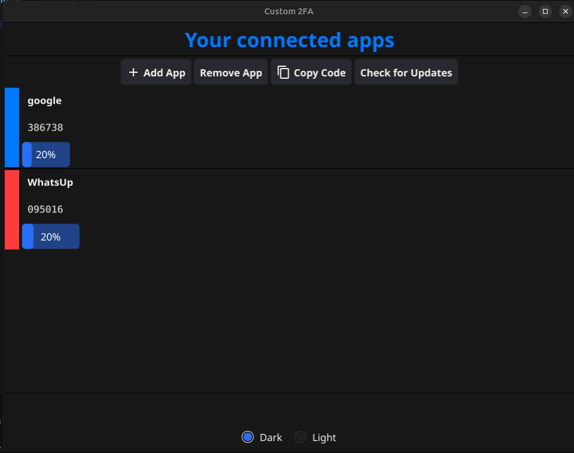
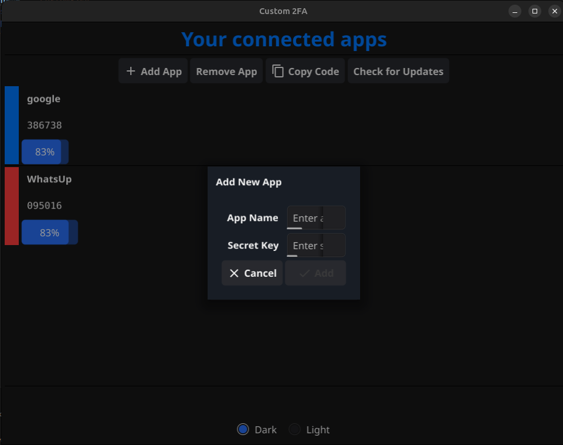
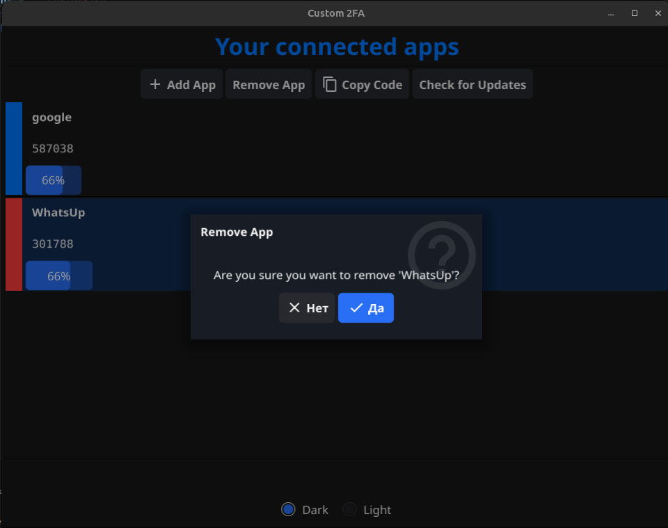
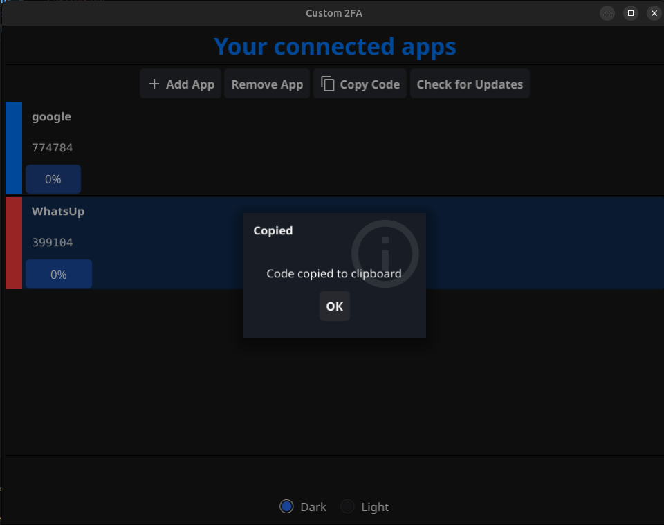

# Custom Desktop-App for 2FA

<h3>How to run on LINUX</h3>

```
make linux
```

<h3>How to run on Win10</h3>

It's essential to have MinGW64 or anything related to GCC to run it

```
make win
```


 

 

 

 
